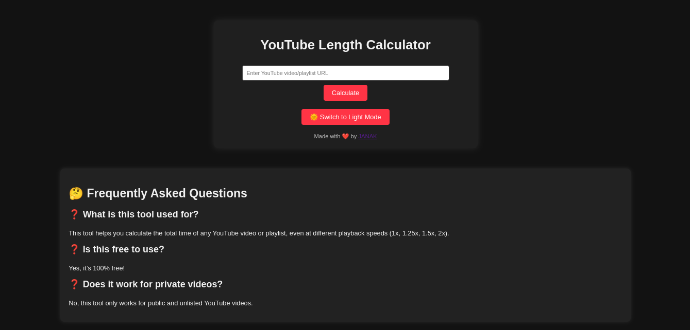

# YouTube Length Calculator

🚀 **YouTube Length Calculator** is a web-based tool that helps users calculate the total duration of any YouTube video or playlist, even at different playback speeds (1x, 1.25x, 1.5x, 2x). It is a simple yet effective utility for content consumers and creators to manage their time efficiently. 

## 🌟 Features

- 📏 Calculate the total duration of a YouTube video or playlist.
- 🎵 Supports different playback speeds (1x, 1.25x, 1.5x, 2x).
- 🌙 Light/Dark mode toggle for better user experience.
- ✅ Completely free and easy to use.
- 🔗 Works with public and unlisted YouTube videos.

## 🛠️ Technologies Used

- **Frontend:** HTML, CSS, JavaScript
- **API:** YouTube Data API 
- **Hosting:** [Wuaze](https://youtubelengthcalculator.wuaze.com)

## 🚀 Live Demo

Check out the live version here: [YouTube Length Calculator](https://youtubelengthcalculator.wuaze.com)

## 📸 Screenshot

## 🎯 How It Works

1. Enter a YouTube video or playlist URL.
2. Click the **Calculate** button.
3. The tool will fetch video details and display the total duration.
4. Adjust playback speed to see the adjusted duration.

## 🤝 Contributing

Contributions are welcome! If you find a bug or have suggestions, feel free to open an issue or submit a pull request.

## 📜 License

This project is open-source and available under the **MIT License**.

---

⭐ **Show your support by starring this repo!**

Made with ❤️ by [Janak](https://github.com/janak-gm)

